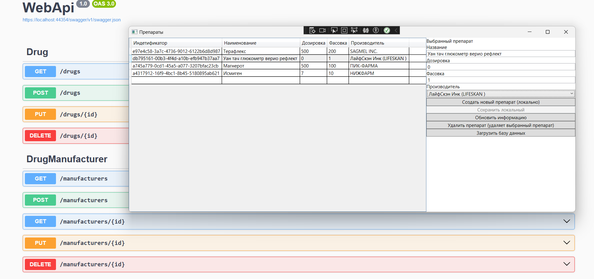

# Pharmacy

## О проектах
Решение включает в себя 2 проекта
1) WebApi - с помощью EF обращается к sqlite базе данных, используется cqrs с помощью пакета AutoMapper.
2) WpfApp - приложение на wpf с использованием mvvvm подключается и достаёт информацию из WebApi.

## Функции
Создание/Редактирование/Обновление данных о препаратах